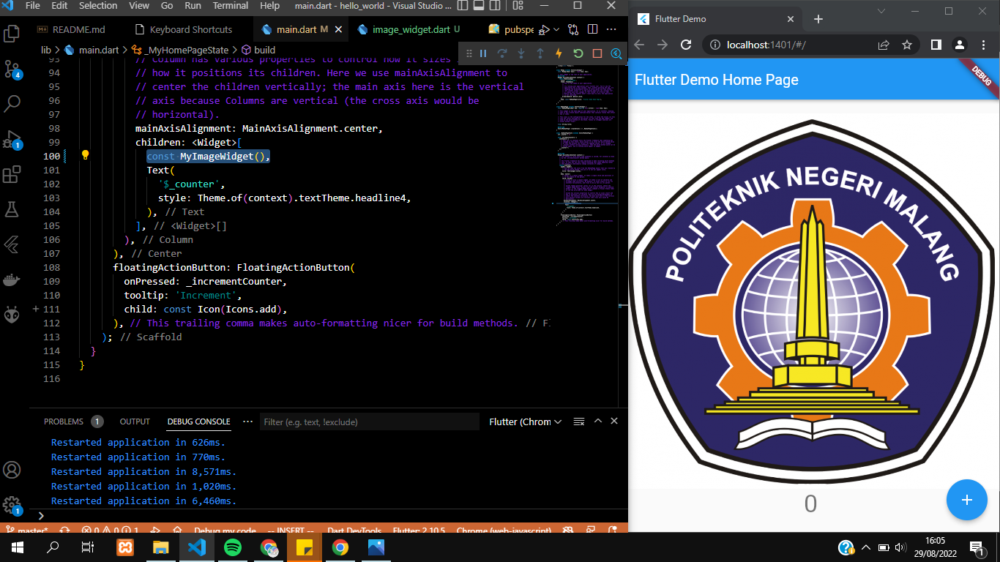
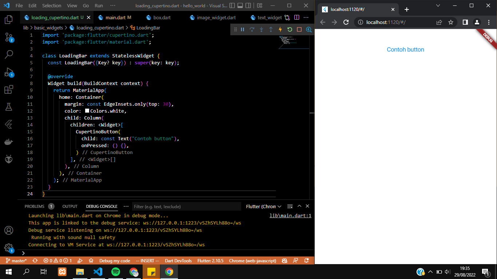
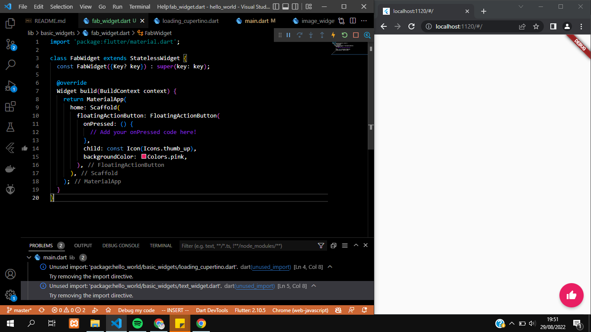
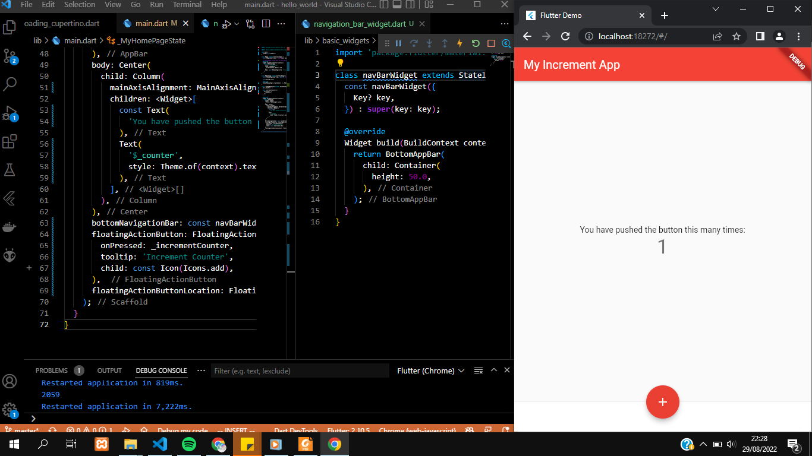

# hello_world

A new Flutter project.

## Praktikum 2
Berikut merupakan hasil praktikum 2. Pada praktikum 2 ini diminta untuk mengubah text yang ditampilkan menjadi nama lengkap. Untuk mengubah text yang ditampilkan maka perlu mengubah isi text pada file main.dart, baris ke 99.

## Praktikun 3
Berikut merupakan hasil praktikum 3 langkah 1. Pada praktikum 3 langkah 1 ini diminta untuk mengganti text widget dengan konstruktor MyTextWidget. Untuk menambahkan konstruktor MyTextWidget pada file main.dart perlu melakukan import text_widget.dart 

Berikut merupakan hasil praktikum 3 langkah 2. Pada praktikum ini akan membuat image widget. Untuk menambahkan image widget maka perlu menambahkan asset logo pada file pubspec.yaml. Berikut merupakan hasil dari menambahkan image widget.

## Praktikum 4
Langkah 1 - Cupertino Button dan Loading Bar.

Langkah 2 - Floating Action Button (FAB)

Langkah 3 - Scaffold Widget
